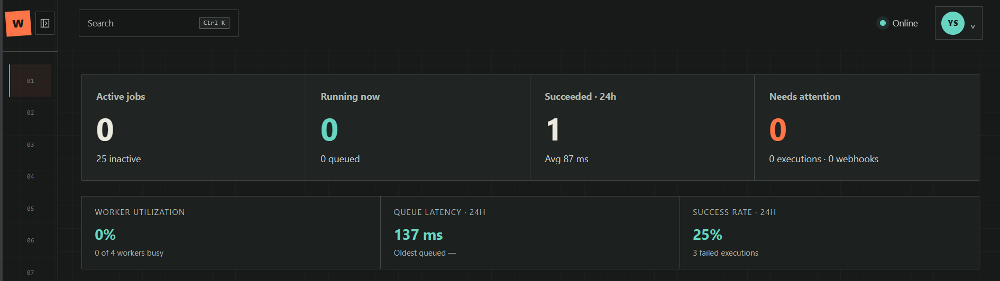
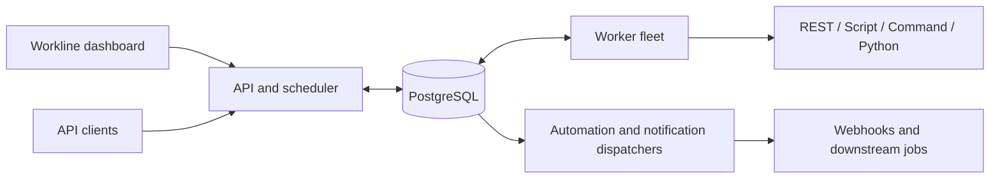

# Background Jobs Framework

Durable job orchestration for Node.js and TypeScript, backed by PostgreSQL and paired with the **Workline** operations dashboard.

[](docs/images/dashboard/overview.png)

Use it to define scheduled or event-driven workflows, execute them across workers, and investigate every run from one UI. PostgreSQL is the source of truth for definitions, queues, progress, revisions, incidents, and delivery state.

## What is included

- `RESTAPI`, `SCRIPT`, `COMMAND`, and `PYTHON` steps with dependencies, retries, conditions, and fan-out.
- Six-field cron schedules, manual runs, inbound webhooks, and job-completion chains.
- Durable queues with priorities, worker leases, cancellation, recovery, and concurrency controls.
- Immutable job revisions, exact-snapshot replay, execution history, and live SSE progress.
- Authentication, roles, API tokens, encrypted managed secrets, and an immutable audit trail.
- Operational attention, notification policies, reliable terminal webhooks, and worker fleet controls.

## How it fits together



## Quick start

Requirements: Node.js 24+, npm, Docker, and Docker Compose.

```powershell
npm install
npm run dev:setup

$env:BOOTSTRAP_ADMIN_EMAIL='admin@example.com'
$env:BOOTSTRAP_ADMIN_NAME='Administrator'
$env:BOOTSTRAP_ADMIN_PASSWORD='replace-with-a-long-unique-password'
npm run auth:bootstrap

npm run dev:server
```

There are no default credentials. Bootstrap creates the first administrator once; later starts only need:

```bash
npm run dev
```

Run the dashboard in another terminal:

```bash
cd dashboard
npm install
npm run dev
```

Open `http://localhost:5173`. Development uses PostgreSQL at `localhost:5432` and the API at `localhost:3000`. Copy `.env.example` to the ignored `.env` file when you need different settings.

## A job at a glance

```json
{
  "id": "daily-report",
  "name": "Daily report",
  "status": "active",
  "schedule": "0 0 8 * * *",
  "timezone": "Europe/Istanbul",
  "STEPS": [
    {
      "ORDER": 1,
      "ID": "fetch",
      "NAME": "Fetch report data",
      "TYPE": "RESTAPI",
      "STEP_PARAMS": {
        "URL": "https://example.internal/report",
        "METHOD": "GET"
      }
    }
  ]
}
```

Schedules include seconds. Jobs can also be manual-only or triggered by inbound webhooks and other jobs. Dynamic commands use `EXECUTABLE` plus `ARGS`, keeping runtime values out of shell syntax.

## API at a glance

| Area | Main endpoints |
| --- | --- |
| Authentication | `/api/auth/login`, `/api/auth/me`, `/api/auth/tokens` |
| Jobs | `/api/jobs`, `/api/jobs/:id`, `/api/jobs/:id/run` |
| Executions | `/api/executions`, `/api/executions/:id`, `/api/executions/:id/events` |
| Automations | `/api/jobs/:id/triggers`, `/hooks/:triggerId` |
| Operations | `/api/attention`, `/api/workers`, `/api/queues` |
| Administration | `/api/security`, `/api/notifications` |

The dashboard is the easiest way to explore these workflows. See the [visual dashboard tour](dashboard/README.md) for screenshots and a route map.

## Useful commands

| Command | Purpose |
| --- | --- |
| `npm run dev` | Start PostgreSQL, migrate, and run the backend watcher |
| `npm run examples:seed` | Add safe disabled examples for secrets, notifications, and automations |
| `npm run jobs:import -- examples/jobs.json --dry-run` | Validate legacy job definitions |
| `npm run worker:isolated` | Run the non-root worker container profile |
| `npm test` | Run backend unit tests |
| `npm run test:integration` | Run PostgreSQL integration tests with Testcontainers |
| `npm run build` | Build the backend |

Dashboard tests and builds run from `dashboard/` with `npm test` and `npm run build`.

## Security scope

This project assumes **trusted job authors**. Command, Python, Script, and plugin code execute with worker privileges; do not expose job authoring to untrusted users. Prefer managed-secret references over literal credentials and use the isolated non-root worker profile when running privileged executors.

The full threat model, remaining limitations, and isolated-worker setup are documented in [Security](docs/security.md).

## More documentation

- [Workline visual dashboard tour](dashboard/README.md)
- [Examples and import workflow](examples/README.md)
- [Security model and worker isolation](docs/security.md)
- [Product expansion notes](docs/product-expansion.md)
- [Configuration reference](.env.example)
