# Workline Dashboard

Workline is the React/Vite operations console for Background Jobs Framework. It brings job authoring, execution investigation, incident response, worker capacity, automations, notifications, and administration into one permission-aware workspace.

[](../docs/images/dashboard/overview.png)

Select any preview in this guide to open its full-resolution capture.

## How operators move through Workline

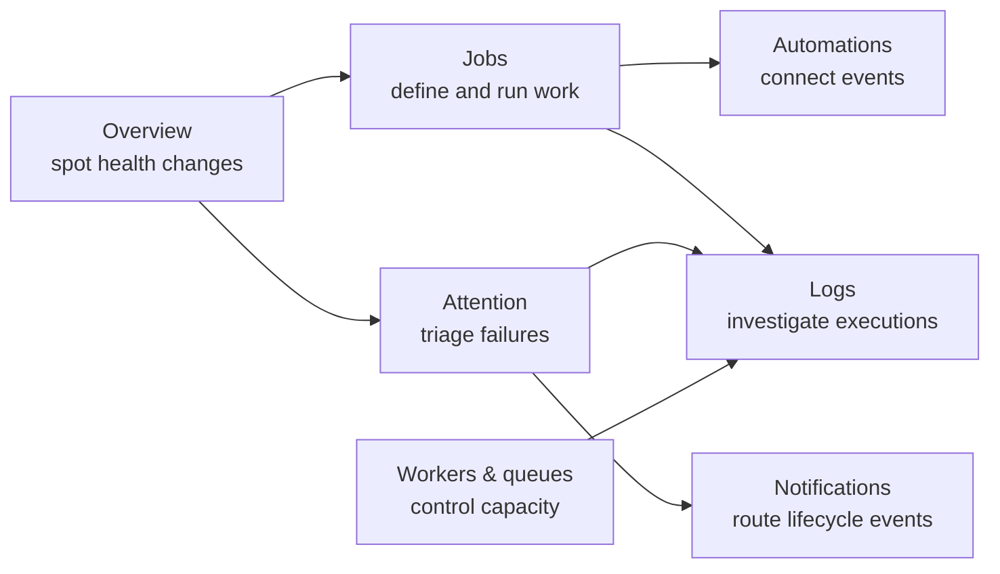

The left navigation mirrors that operating loop: **Operate** contains Overview, Attention, and Logs; **Build** contains Jobs and Automations; **Manage** contains Workers, Audit, and Administration. Press `Ctrl+K` or `Cmd+K` to search jobs and jump between workspaces.

## Visual tour

### 1. Read system health at a glance

The overview shown above combines current workload with 24-hour signals. The first row answers “what needs action now?”; the execution-health chart explains when request, success, and failure volume changed. Only populated time buckets open filtered logs.

[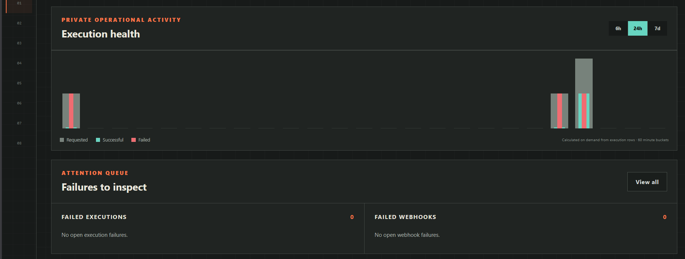](../docs/images/dashboard/overview-activity.png)

Hovering a populated bar opens a compact distribution card with counts, typical duration, slow-run threshold, and average queue wait.

[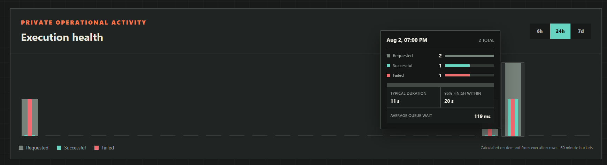](../docs/images/dashboard/execution-health.png)

Look for:

- active, running, queued, successful, and attention counts;
- worker utilization, queue latency, and success rate;
- selectable 6-hour, 24-hour, and 7-day execution-health windows;
- direct paths into the attention queue and exact log intervals.

### 2. Manage jobs and understand the workflow

The Jobs workspace provides URL-persisted search, status, schedule, executor, timezone, and sort controls. Every job card exposes run, edit, detail, logs, duplicate, export, and activation controls according to the signed-in role.

[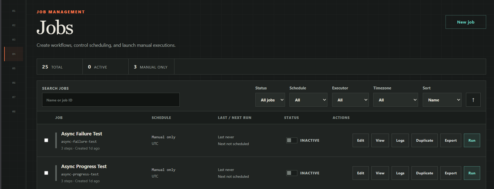](../docs/images/dashboard/jobs.png)

Job detail turns the definition into an execution-oriented view with the current version, schedule, queue, concurrency, and run controls together.

[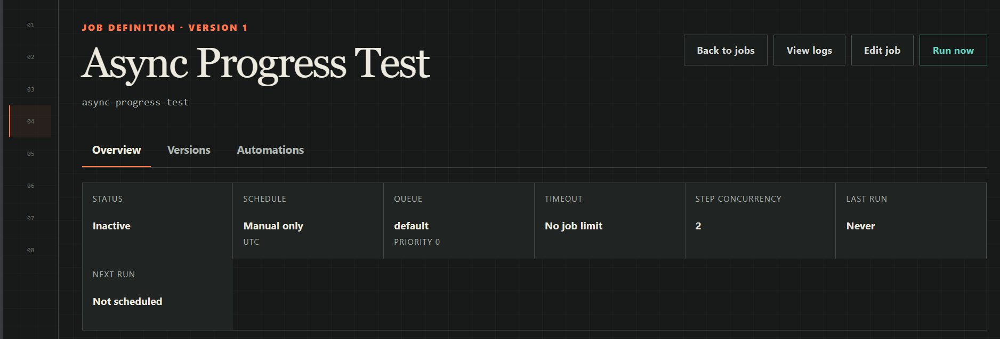](../docs/images/dashboard/workflow.png)

Dependency levels show which steps may run together and which steps wait on earlier output.

[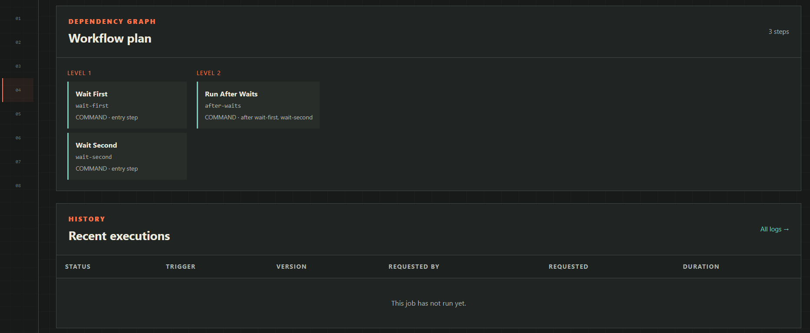](../docs/images/dashboard/workflow.png)

From a job, operators can also inspect immutable versions, compare revisions, roll back safely, backfill a time range, or run with validated JSON input.

### 3. Connect jobs with event-driven automations

Automations support authenticated inbound webhooks and job-completion chains. Relationships are scoped to a target job, can be disabled without deletion, and keep durable trigger-event history.

[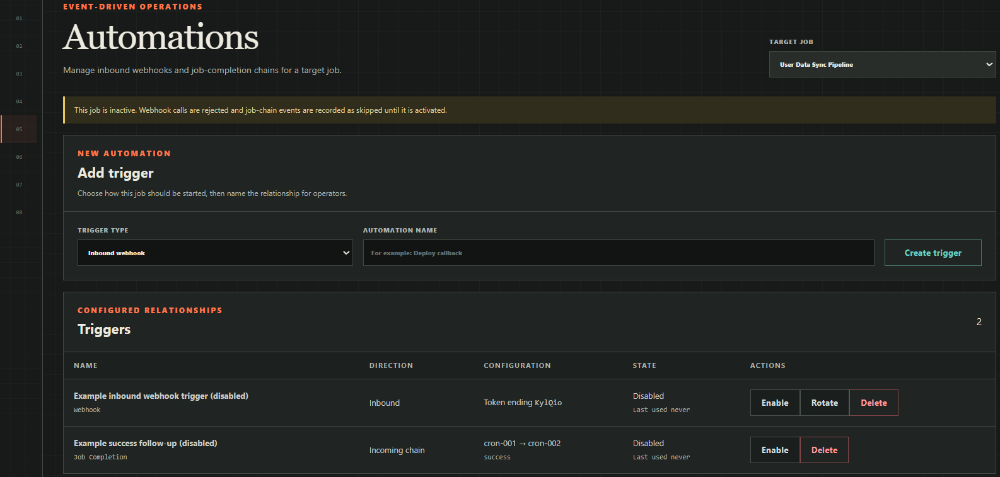](../docs/images/dashboard/automations.png)

Webhook tokens are shown once when created or rotated. Job-completion chains select a source job and terminal states; cycle checks prevent recursive automation graphs.

### 4. Investigate an execution without losing context

Logs retain filters in the URL and open execution details over the result table. The detail drawer keeps actor, timing, input, definition snapshot, step attempts, outputs, webhooks, and replay options together.

[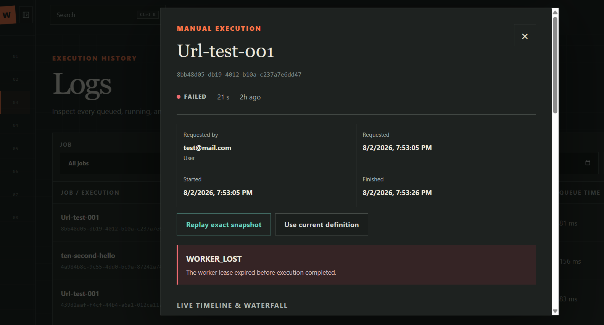](../docs/images/dashboard/execution-investigation.png)

The waterfall separates queue delay from runtime. “Replay exact snapshot” uses the persisted job version and input, while “Use current definition” makes the version change explicit.

### 5. Triage operational attention

Attention groups execution and webhook failures into lifecycle states: Open, Acknowledged, Snoozed, Ignored, and Resolved. Filters and pagination remain URL-addressable, and the resizable detail drawer keeps the incident timeline beside the queue.

[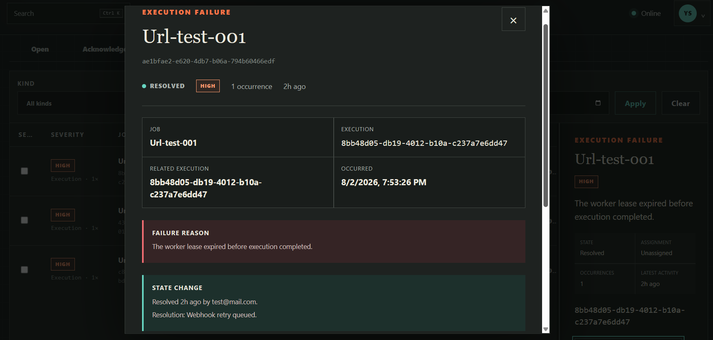](../docs/images/dashboard/attention-triage.png)

Administrators can assign ownership, change severity, acknowledge, snooze, ignore, resolve, rerun, or retry a webhook. Every state change records the actor and timestamp.

### 6. Control worker and queue capacity

The worker workspace shows live capacity first. Offline and stopped registrations stay collapsed as history, while queue drill-downs summarize only live subscribers and preview affected jobs and recent executions.

[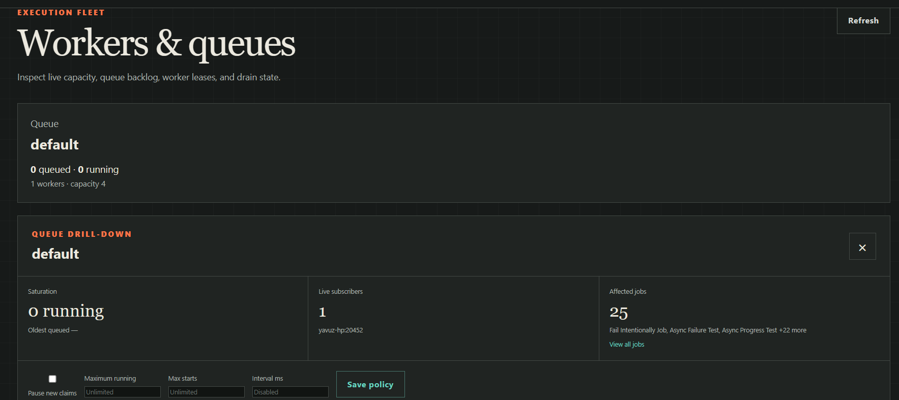](../docs/images/dashboard/queue-details.png)

Administrators can drain or resume a live worker, pause new queue claims, cap concurrent work, and configure rate windows. Historical registrations are cleaned through the backend retention command rather than silently disappearing.

### 7. Route incident notifications without exposing secrets

Notification channels reference write-only managed-secret names, so endpoint URLs and signing keys never appear in the console. Policies connect incident kinds, severity thresholds, jobs, and lifecycle events to a destination.

[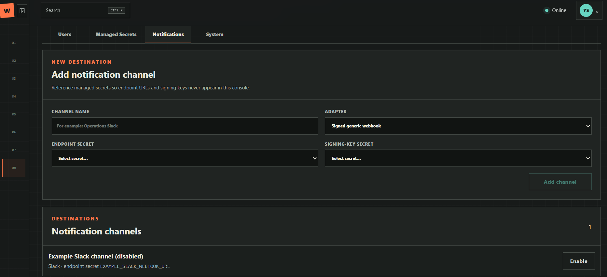](../docs/images/dashboard/notifications.png)

Channels and policies can be prepared while disabled. Delivery attempts use a durable outbox and failed deliveries can be retried from the same administration workspace.

## Route map

| Workspace | Route | Primary use |
| --- | --- | --- |
| Overview | `/` | Current health, execution activity, and attention summary |
| Attention | `/attention` | Incident lifecycle, ownership, remediation, and timeline |
| Logs | `/logs` | Filtered execution history and detailed investigation |
| Jobs | `/jobs` | Search, author, activate, run, duplicate, and export jobs |
| Job detail | `/jobs/:jobId` | Workflow plan, versions, automations, backfill, and recent runs |
| Automations | `/jobs?view=automations` | Inbound webhook and job-completion relationships |
| Workers | `/workers` | Queue policy, live capacity, drain state, and worker history |
| Audit | `/audit` | Immutable security and operational audit events |
| Administration | `/admin` | Users, managed secrets, notifications, and system status |

## Development

Start the backend on port 3000, then run the independent dashboard development server:

```bash
cd dashboard
npm install
npm run dev
```

Vite proxies `/api` and `/health` to the backend, avoiding a development CORS dependency.

Run checks with:

```bash
npm test
npm run build
```

The production bundle is written to `dashboard/dist`. Production hosting must serve `index.html` for unknown frontend routes while continuing to proxy `/api` and `/health` to the backend.

## Authentication and deployment

The dashboard never stores session or API tokens in browser storage. Login uses the backend's `HttpOnly` session cookie, mutating requests attach the CSRF cookie value as `X-CSRF-Token`, and live execution streams use the same credentials.

Keep the dashboard and API on the same origin where possible. For an intentional cross-origin deployment, set `VITE_API_BASE_URL` at build time and include that exact origin in the backend `CORS_ALLOWED_ORIGINS` list.

Viewers have read-only operational access, operators can run and cancel work, and administrators manage definitions, automations, workers, incidents, notifications, users, secrets, and runtime controls.
